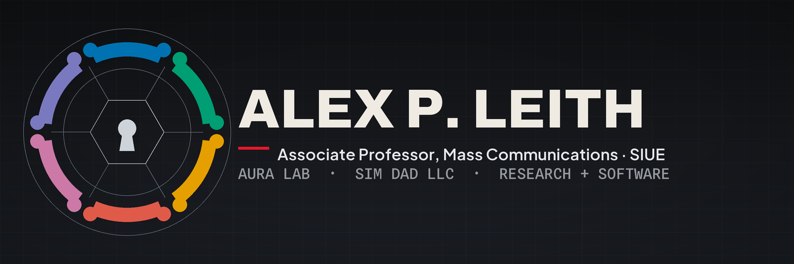

  

### Alex P. Leith, PhD

**Associate Professor of Mass Communications · Director, [AURA Lab](https://aura-lab-siue.github.io/) @ SIUE · Founder, [SIM DAD LLC](https://simdadllc.com)**

I study how people communicate, connect, and cope in **virtual environments** — social VR, remote workplaces, live-streaming, and online gaming communities — and I build the software the research runs on. I pair **computational methods** (NLP, topic modeling, time-series) with survey and qualitative work to produce findings that are theoretically grounded and practically useful. Two halves, one method: **research** and **software**.

[`apleith.com`](https://apleith.com) &nbsp;·&nbsp; [aleith@siue.edu](mailto:aleith@siue.edu) &nbsp;·&nbsp; [ORCID](https://orcid.org/0000-0003-1310-6763) &nbsp;·&nbsp; [@APLeith](https://x.com/APLeith)

---

## What I Work On

My research sits at the intersection of **human-computer interaction**, **organizational communication**, and **data science**:

- **VR & Virtual Workplaces** — communication, equity, and well-being in virtual classrooms and remote work
- **VR for Neurodiversity** — how platforms like VRChat may reduce communication barriers for autistic users
- **AI & Human Interaction** — AI agents for interaction modeling and feedback in technical learning
- **Streaming & Parasocial Relationships** — audience engagement and community dynamics on platforms like Twitch

## SIM DAD LLC — Research Software

Through [SIM DAD LLC](https://simdadllc.com) I build and license the tools my research depends on:

| Tool | What it does |
|---|---|
| **TASS** | Text analysis and corpus scoring for behavioral research |
| **Ibis** | Transcription pipeline for interview and streaming audio |
| **Lector** | Read-along, text-to-speech reader |
| **Resero** | Encrypted-vault recovery |

## Open-Source

### [`mc-careers-dashboard`](https://github.com/SIM-Lab-SIUE/mc-careers-dashboard)
Interactive SvelteKit dashboard mapping mass-communications career paths — occupations, state-level wages, required technologies, and aligned university courses.

### [`open-webui-launcher`](https://github.com/apleith/open-webui-launcher)
Beginner-friendly launcher that automates local-LLM setup (Ollama + Open WebUI) with hardware checks and safe defaults for classroom use. Built for instructors, not just engineers.

### [`mccoursepack`](https://github.com/SIM-Lab-SIUE/mccoursepack) *(R package)*
Course-delivery package for MC 451/501: weekly content pulls, Quarto/PDF-first assignment templates, and reproducible workflows for research-methods students.

## Research Datasets

Large-scale datasets collected and managed for peer-reviewed research. Access is restricted (ToS/IRB); documentation is available on request.

| Dataset | Scale |
|---|---|
| **Twitch Chat Logs** (2018–2019) | 321M+ messages · 118K channels · 6.5M unique users |
| **VRChat Tweets** (2014–2023) | 1.4M+ original English-language tweets |
| **Remote Work Tweets** (2020–2021) | 1.4M+ tweets from 888K+ unique users |

## Selected Recent Publications

**Leith, A.P., et al. (2025).** Stress and coping in VRChat: A mixed-method case study. *Computers in Human Behavior Reports.* [doi](https://doi.org/10.1016/j.chbr.2025.100843)

**Ratan, R.A., …, Leith, A.P., Bailenson, J.N. (2025).** Time matters in VR: Students benefit from longer VR class duration, but certain outcomes decline after 45 minutes. *Computers & Education.* [doi](https://doi.org/10.1016/j.compedu.2025.105328)

**Beyea, D., …, Leith, A.P. (2025).** Zoom fatigue in review: A meta-analytical examination of videoconferencing fatigue's antecedents. *Computers in Human Behavior Reports.* [doi](https://doi.org/10.1016/j.chbr.2024.100571)

**Leith, A.P. (2021).** Parasocial cues: The ubiquity of parasocial relationships on Twitch. *Communication Monographs.* [doi](https://doi.org/10.1080/03637751.2020.1868544)

→ Full list on [ORCID](https://orcid.org/0000-0003-1310-6763) or my [CV](https://apleith.com/files/Leith_CV.pdf)

## Toolkit

**Methods** — Structural topic modeling · NLP / text analysis · time series · survey design · meta-analysis · mixed methods · ML classification
**Stack** — tidyverse · quanteda · academictwitteR · ggplot2 · Bookdown · SvelteKit

## GitHub

## Let's Connect

I'm open to conversations about **research collaborations**, **consulting on user/audience research**, or **applied data science in media and tech**. Reach out if you're:

- An industry team studying user behavior, engagement, or well-being in digital products
- A researcher working on VR, remote work, AI, or online communities
- A creator or platform interested in audience research

[aleith@siue.edu](mailto:aleith@siue.edu) &nbsp;·&nbsp; [hello@simdadllc.com](mailto:hello@simdadllc.com) &nbsp;·&nbsp; [apleith.com](https://apleith.com)
